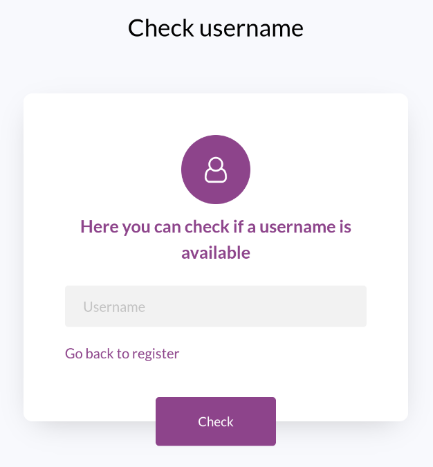

# Docker Basics Project

Hello, Platzi team! I'm Juan Andrés and this is the little project i made to prove my knowledge about Docker :). Let me explain what'll you
how to install this and what you'll find here

## Table of contents
- [Installation](#installation) 
- [Get started](#root-project-folder)
- [Final message](#final-message)
- [Alerts](#alerts)

## Installation
Okay, i know that you already have docker installed in your computer. Build and run these containers it's really easy. Make sure you are in the project root and run:

```bash
./build.compose.sh
```
And all the process is going to start. In case you want to remove the containers, images and the network created by `docker compose` just
run

```bash
./stop.compose.sh
```

## Root project folder
In this folder are located the following files: **build.compose.sh**, **stop.compose.sh**, **compose.yml** and of course the file you're
reading. Let's see what's inside those files:

### Build.compose.sh
This is a bash script - yeah, i can hold my own with bash. I learned the basics a few months ago when i started to create custom commands
and scripts for my linux desktop! - that basically manages all the process of **building** and **running** the containers.

### Stop.compose.sh
This is another bash script, but **stops** and **deletes** the containers and images created via `docker compose build/up`. Please note that the containers deleted are the ones that are set in the `container_name` property inside the .yml file

> Note: This bash script also removes the default network created with `docker compose`

### Compose.yml
Inside this file is all the logic related to the orchestration of our containers. As you may noticed, i added a new property that
we didn't learn in the class: **container_name**. I added this property because the default name was too long.


## Backend
In the backend folder is stored the implementation of a **bloom filter**. This was a project that i made for a collegue class a few months ago. I taked the implementation from Geeks for geeks but added an extra feature: a database. The idea was to reduce the amount of queries
to a db called **users** with the filter. I show this in a really simple way: printing a message. Each time a query is made to the db, the
`Db checked!` message appears in the console.

The backend API has three endpoints: **add**, **check_username** and **get_users**. The first ones are integrated in the frontend, but the last one is not. Basically i didn't integrate that endpoint in the frontend because i wanted to try it inside the container itself. So, 
you can run

```bash
docker exec -it front sh
```
to access to the **frontend container shell** and then

```bash
curl back:8000/bloom/users/
```

This way you'll get a list of users. The main idea behind do it this way it's the fact that i'm communicating with the backend container
through the DNS provided by the custom network created via `docker compose`! It's amazing that i don't need to type the whole ip but just the container's name

### Logs
To follow the logs of the container, run 

```bash
docker logs -f back
```

This way you can see when the `Db checked!` message is printed to the console :)

> Note: Hey! You don't need to perform any migrations to the database. The application works out of the box!

### Frontend
Here you'll find a simple template made in bootstrap. I took this template from [colorlib](https://colorlib.com/). You can access to the application with
http://localhost:5000/site/register.html. There are two pages: **register** and **usernames**. 

### Register
In this page you can create a user. A username and a password **are required** in order to create an account. Let me show you how it looks


### Usernames
Here you can check if a username is available or not. Let's see how it looks



## Alerts
This is how the messages are displayed. The library i'm using is the classic **SweetAlert**


## Final message
Thanks, Amin! I learned a lot with this course. I hope to see you teaching more docker courses ^^


